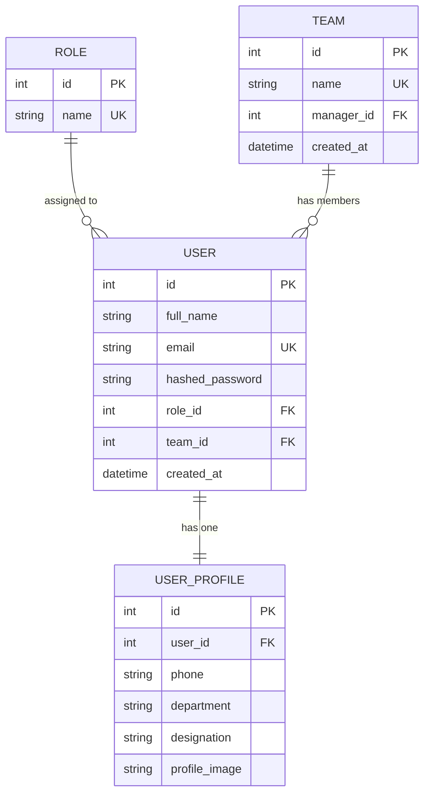

# Database Design — Milestone 1

## Entity-Relationship Diagram

> Paste the block above into any Mermaid-compatible viewer (GitHub renders
> it natively, or use https://mermaid.live) to see the diagram.

## Tables

### `roles`

| Column | Type | Constraints | Notes |
|---|---|---|---|
| id | Integer | PK, auto-increment | |
| name | String | UNIQUE, NOT NULL | employee / reviewer / manager / administrator |

Seeded automatically on backend startup — the four roles always exist
before any user registers.

### `teams`

| Column | Type | Constraints | Notes |
|---|---|---|---|
| id | Integer | PK, auto-increment | |
| name | String | UNIQUE, NOT NULL | |
| manager_id | Integer | FK → users.id, nullable | the user managing this team |
| created_at | DateTime | server default: now() | |

### `users`

| Column | Type | Constraints | Notes |
|---|---|---|---|
| id | Integer | PK, auto-increment | |
| full_name | String | NOT NULL | |
| email | String | UNIQUE, NOT NULL, indexed | login identifier |
| hashed_password | String | NOT NULL | bcrypt hash, never plaintext |
| role_id | Integer | FK → roles.id, NOT NULL | |
| team_id | Integer | FK → teams.id, nullable | a user may not belong to a team yet |
| created_at | DateTime | server default: now() | |

### `user_profiles`

| Column | Type | Constraints | Notes |
|---|---|---|---|
| id | Integer | PK, auto-increment | |
| user_id | Integer | FK → users.id, UNIQUE, NOT NULL | one profile per user |
| phone | String | nullable | |
| department | String | nullable | |
| designation | String | nullable | |
| profile_image | String | nullable | file path or URL |

Kept as a separate table from `users` so the core auth/login path never
touches these optional fields — a user can register and log in with
nothing but name, email, and password, and fill in the rest later.

## Relationships

- **One Role → Many Users** (`roles.id` ← `users.role_id`). Every user has
  exactly one role.
- **One Team → Many Users** (`teams.id` ← `users.team_id`). A team can have
  many members; a user belongs to at most one team at a time.
- **Team → Manager** (`teams.manager_id` → `users.id`). Each team optionally
  points to the user who manages it — separate from team membership.
- **One User → One UserProfile** (`users.id` ← `user_profiles.user_id`,
  unique). A 1:1 extension table for optional details.

## Design decisions

- **Roles are a normalized table, not an enum column**, so new roles can be
  added later without a schema migration — just an insert into `roles`.
- **`UserProfile` is separate from `User`** to keep the registration/login
  path minimal — phone, department, designation, and profile image are
  edited later via `/me/profile`, not required at signup.
- **`team_id` is nullable** because a newly registered user has no team
  until an administrator or manager assigns one.
- **Passwords are never stored in plaintext** — only a bcrypt hash.

## What Milestone 2+ will add

The `decisions` table (title, problem statement, category, status,
created_by) and later `alternatives`, `discussions`, and `approvals`
tables are out of scope for Milestone 1, but the schema above extends
cleanly: `decisions.created_by` will be a straightforward FK to
`users.id`, following the same pattern used here.
