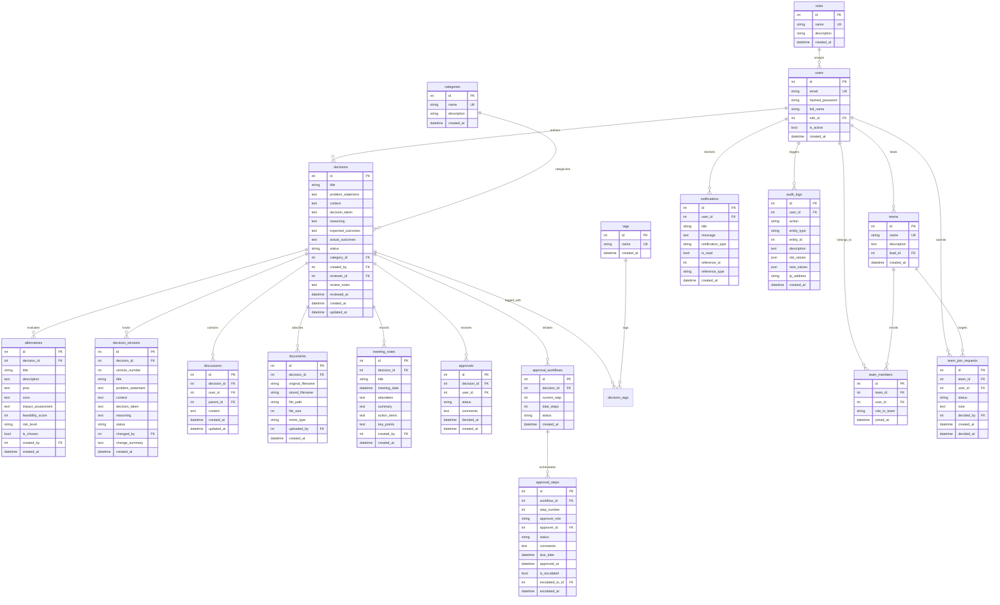

# Expert Decision Replay Platform — Database Design Document

This document describes the complete relational database architecture, entity schemas, constraints, and relationships implemented in the Expert Decision Replay Platform.

---

## 1. Entity-Relationship Diagram (ERD)

---

## 2. Table Schemas & Specifications

### 2.1 `roles`
- **Purpose**: Defines core access roles across the platform.
- **Fields**:
  - `id` (Integer, Primary Key, Auto-increment)
  - `name` (String(50), Unique, Not Null) — `Employee`, `Reviewer`, `Manager`, `Administrator`
  - `description` (String(255), Nullable)
  - `created_at` (DateTime, Default: UTC Now)
  - `updated_at` (DateTime, Default: UTC Now)
- **Relationships**: `users` (one-to-many).

### 2.2 `users`
- **Purpose**: Authenticated user identity and account credentials.
- **Fields**:
  - `id` (Integer, Primary Key, Auto-increment)
  - `email` (String(255), Unique, Indexed, Not Null)
  - `hashed_password` (String(255), Not Null) — bcrypt hash (12 rounds)
  - `full_name` (String(255), Not Null)
  - `role_id` (Integer, ForeignKey('roles.id'), Not Null)
  - `is_active` (Boolean, Default: True, Not Null)
  - `created_at` (DateTime, Default: UTC Now)
  - `updated_at` (DateTime, Default: UTC Now)
- **Relationships**: Many-to-one with `roles`; One-to-many with `decisions`, `audit_logs`, `notifications`, `team_members`.

### 2.3 `categories`
- **Purpose**: High-level organizational classifications for decisions (e.g. Architecture, Security, Infrastructure).
- **Fields**:
  - `id` (Integer, Primary Key, Auto-increment)
  - `name` (String(100), Unique, Indexed, Not Null)
  - `description` (Text, Nullable)
  - `created_at` (DateTime, Default: UTC Now)
  - `updated_at` (DateTime, Default: UTC Now)

### 2.4 `tags` & `decision_tags`
- **Purpose**: Flexible folksonomy tagging for decisions.
- **Fields (`tags`)**:
  - `id` (Integer, Primary Key, Auto-increment)
  - `name` (String(50), Unique, Indexed, Not Null)
  - `created_at` (DateTime, Default: UTC Now)
- **Association Table (`decision_tags`)**:
  - `decision_id` (Integer, ForeignKey('decisions.id', ondelete='CASCADE'), Primary Key)
  - `tag_id` (Integer, ForeignKey('tags.id', ondelete='CASCADE'), Primary Key)

### 2.5 `decisions`
- **Purpose**: Central entity capturing the entire decision record.
- **Fields**:
  - `id` (Integer, Primary Key, Auto-increment)
  - `title` (String(255), Indexed, Not Null)
  - `problem_statement` (Text, Not Null)
  - `context` (Text, Not Null)
  - `decision_taken` (Text, Not Null)
  - `reasoning` (Text, Not Null)
  - `expected_outcomes` (Text, Nullable)
  - `actual_outcomes` (Text, Nullable)
  - `status` (String(50), Default: 'Draft', Indexed, Not Null)
  - `category_id` (Integer, ForeignKey('categories.id'), Nullable)
  - `created_by` (Integer, ForeignKey('users.id'), Not Null)
  - `reviewer_id` (Integer, ForeignKey('users.id'), Nullable)
  - `review_notes` (Text, Nullable)
  - `reviewed_at` (DateTime, Nullable)
  - `created_at` (DateTime, Default: UTC Now, Indexed)
  - `updated_at` (DateTime, Default: UTC Now)
- **Constraints**: Valid `status` values: `Draft`, `Submitted`, `Under Review`, `Approved`, `Rejected`, `Archived`.

### 2.6 `decision_versions`
- **Purpose**: Immutable snapshot history of decisions over time.
- **Fields**:
  - `id` (Integer, Primary Key, Auto-increment)
  - `decision_id` (Integer, ForeignKey('decisions.id', ondelete='CASCADE'), Indexed, Not Null)
  - `version_number` (Integer, Not Null)
  - `title`, `problem_statement`, `context`, `decision_taken`, `reasoning`, `status` (Cloned snapshot values)
  - `changed_by` (Integer, ForeignKey('users.id'), Not Null)
  - `change_summary` (Text, Nullable)
  - `created_at` (DateTime, Default: UTC Now)
- **Indexes**: Composite unique index on `(decision_id, version_number)`.

### 2.7 `alternatives`
- **Purpose**: Captures viable alternatives considered alongside the chosen decision.
- **Fields**:
  - `id` (Integer, Primary Key, Auto-increment)
  - `decision_id` (Integer, ForeignKey('decisions.id', ondelete='CASCADE'), Indexed, Not Null)
  - `title` (String(255), Not Null)
  - `description` (Text, Not Null)
  - `pros` (Text, Nullable)
  - `cons` (Text, Nullable)
  - `impact_assessment` (Text, Nullable)
  - `feasibility_score` (Integer, Check: 1 to 10)
  - `risk_level` (String(50), Default: 'Medium') — `Low`, `Medium`, `High`, `Critical`
  - `is_chosen` (Boolean, Default: False)
  - `created_by` (Integer, ForeignKey('users.id'), Not Null)
  - `created_at` (DateTime, Default: UTC Now)

### 2.8 `discussions`
- **Purpose**: Hierarchical threaded discussions and replies on decisions.
- **Fields**:
  - `id` (Integer, Primary Key, Auto-increment)
  - `decision_id` (Integer, ForeignKey('decisions.id', ondelete='CASCADE'), Indexed, Not Null)
  - `user_id` (Integer, ForeignKey('users.id'), Not Null)
  - `parent_id` (Integer, ForeignKey('discussions.id', ondelete='CASCADE'), Nullable)
  - `content` (Text, Not Null)
  - `created_at` (DateTime, Default: UTC Now)
  - `updated_at` (DateTime, Default: UTC Now)

### 2.9 `documents`
- **Purpose**: Metadata for file attachments uploaded for decisions.
- **Fields**:
  - `id` (Integer, Primary Key, Auto-increment)
  - `decision_id` (Integer, ForeignKey('decisions.id', ondelete='CASCADE'), Indexed, Not Null)
  - `original_filename` (String(255), Not Null)
  - `stored_filename` (String(255), Not Null)
  - `file_path` (String(500), Not Null)
  - `file_size` (Integer, Not Null)
  - `mime_type` (String(100), Not Null)
  - `uploaded_by` (Integer, ForeignKey('users.id'), Not Null)
  - `created_at` (DateTime, Default: UTC Now)

### 2.10 `meeting_notes`
- **Purpose**: Synchronous meeting discussions attached to decisions.
- **Fields**:
  - `id` (Integer, Primary Key, Auto-increment)
  - `decision_id` (Integer, ForeignKey('decisions.id', ondelete='CASCADE'), Indexed, Not Null)
  - `title` (String(255), Not Null)
  - `meeting_date` (DateTime, Not Null)
  - `attendees` (Text, Nullable)
  - `summary` (Text, Not Null)
  - `action_items` (Text, Nullable)
  - `key_points` (Text, Nullable)
  - `created_by` (Integer, ForeignKey('users.id'), Not Null)
  - `created_at` (DateTime, Default: UTC Now)

### 2.11 `approvals` & `approval_workflows`
- **Purpose**: Decision review outcomes and multi-step governance chains.
- **Fields (`approvals`)**:
  - `id`, `decision_id`, `user_id`, `status` (`Approved`/`Rejected`), `comments`, `decided_at`.
- **Fields (`approval_workflows`)**:
  - `id`, `decision_id`, `current_step`, `total_steps`, `status`.
- **Fields (`approval_steps`)**:
  - `id`, `workflow_id`, `step_number`, `approver_role`, `approver_id`, `status`, `comments`, `due_date`, `approved_at`, `is_escalated`, `escalated_to_id`, `escalated_at`.

### 2.12 `notifications`
- **Purpose**: In-app user notifications.
- **Fields**:
  - `id` (Integer, Primary Key, Auto-increment)
  - `user_id` (Integer, ForeignKey('users.id', ondelete='CASCADE'), Indexed, Not Null)
  - `title` (String(255), Not Null)
  - `message` (Text, Not Null)
  - `notification_type` (String(50), Not Null)
  - `is_read` (Boolean, Default: False, Indexed)
  - `reference_id` (Integer, Nullable)
  - `reference_type` (String(50), Nullable)
  - `created_at` (DateTime, Default: UTC Now, Indexed)

### 2.13 `audit_logs`
- **Purpose**: Append-only tamper-resistant audit records for compliance.
- **Fields**:
  - `id` (Integer, Primary Key, Auto-increment)
  - `user_id` (Integer, ForeignKey('users.id', ondelete='SET NULL'), Nullable)
  - `action` (String(50), Indexed, Not Null)
  - `entity_type` (String(50), Indexed, Not Null)
  - `entity_id` (Integer, Nullable)
  - `description` (Text, Not Null)
  - `old_values` (JSON, Nullable)
  - `new_values` (JSON, Nullable)
  - `ip_address` (String(45), Nullable)
  - `created_at` (DateTime, Default: UTC Now, Indexed)

### 2.14 `teams`, `team_members` & `team_join_requests`
- **Purpose**: Multi-department organizational structures, rosters, and join requests.
- **Fields (`teams`)**:
  - `id`, `name` (Unique), `description`, `lead_id` (ForeignKey to users), `created_at`.
- **Fields (`team_members`)**:
  - `id`, `team_id`, `user_id`, `role_in_team`, `joined_at`.
- **Fields (`team_join_requests`)**:
  - `id`, `team_id`, `user_id`, `status` (`pending`, `approved`, `rejected`), `note`, `decided_by`, `created_at`, `decided_at`.
