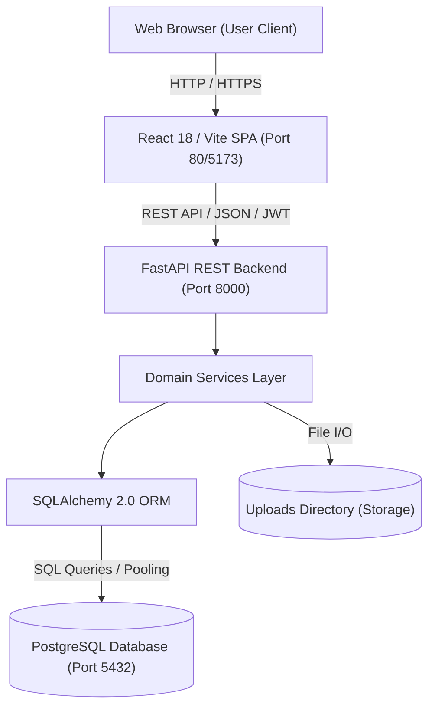
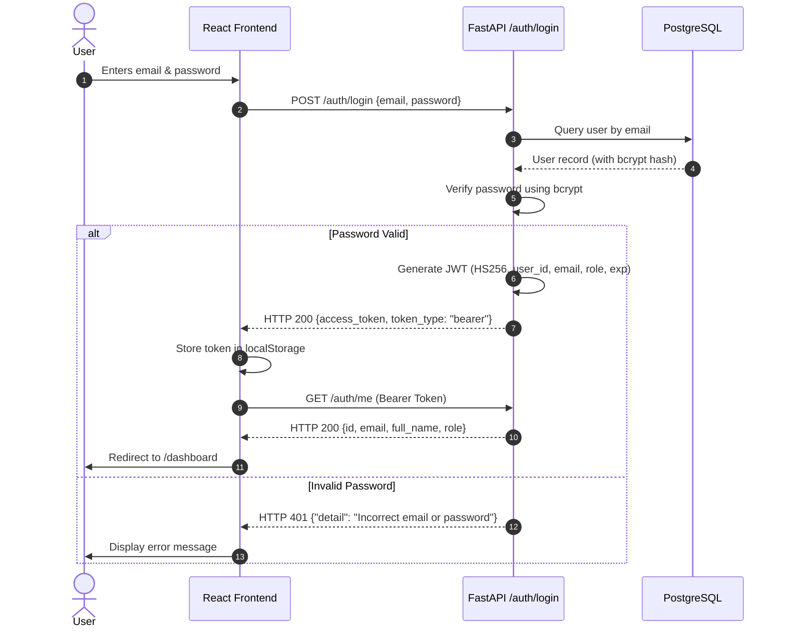
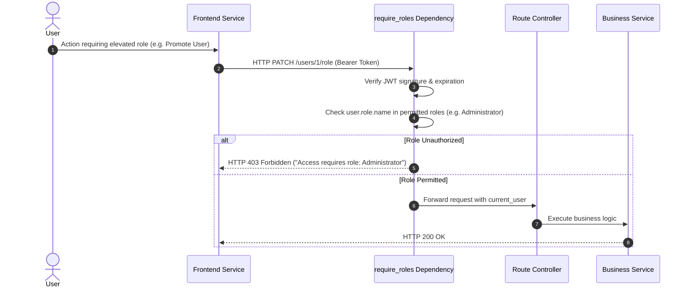
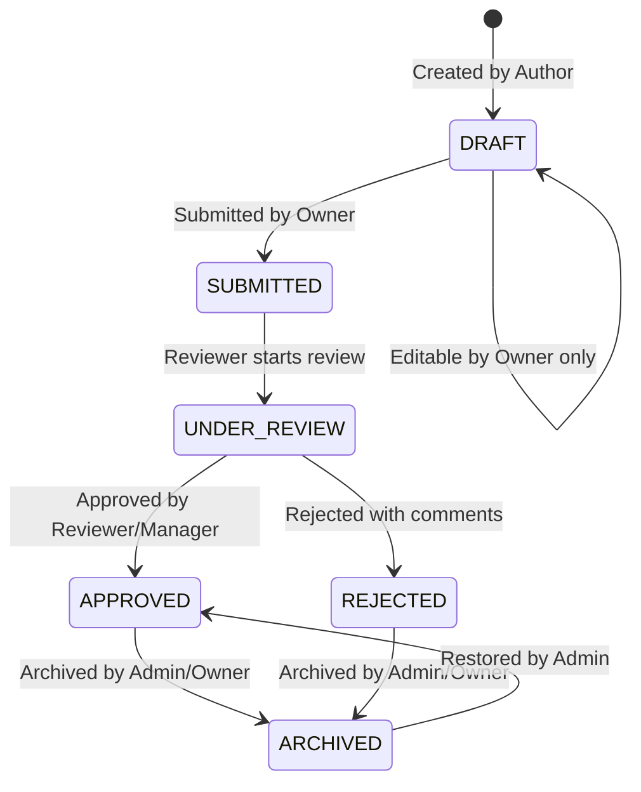
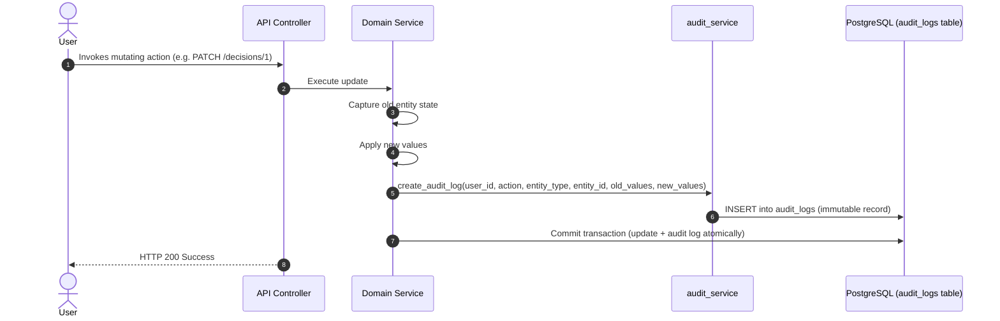
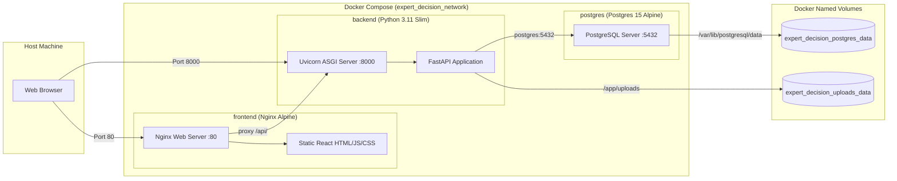

# Expert Decision Replay Platform — System Architecture Document

This document details the architectural design and data flow patterns of the Expert Decision Replay Platform.

---

## 1. High-Level Architecture

The system is built as a modular client-server web architecture consisting of a single-page React frontend, a high-performance FastAPI backend, a relational PostgreSQL database, and a persistent local filesystem storage for document attachments.



---

## 2. Component Architecture

The platform separates responsibilities cleanly across layers:

```
+---------------------------------------------------------------------------------+
|                               Presentation Layer                                |
|   React Components  |  React Router DOM  |  AuthContext  |  Axios/Fetch Services|
+---------------------------------------------------------------------------------+
                                        │
                                        ▼ (JSON over HTTP)
+---------------------------------------------------------------------------------+
|                                 API Route Layer                                 |
|   /auth  /users  /decisions  /approvals  /notifications  /audit-logs  /teams     |
|   /reports  /dashboard  /search  /knowledge-repository  /categories  /tags      |
+---------------------------------------------------------------------------------+
                                        │
                                        ▼ (Dependency Injection: DB & User)
+---------------------------------------------------------------------------------+
|                               Business Logic Layer                              |
|   auth_service       decision_service      approval_workflow_service            |
|   team_service       document_service      notification_service                 |
|   audit_service      report_service        knowledge_repository_service         |
+---------------------------------------------------------------------------------+
                                        │
                                        ▼ (Entities & Transactions)
+---------------------------------------------------------------------------------+
|                               Data & Storage Layer                              |
|   SQLAlchemy Models (19 Entities)    |    Local Document Storage                |
|   PostgreSQL Relational DB Engine    |    /app/uploads/decisions/{id}/          |
+---------------------------------------------------------------------------------+
```

---

## 3. Frontend Architecture

The frontend is constructed using **React 18** and bundled with **Vite 5**.

### Key Architectural Patterns
- **Client-Side Routing**: Handled by `react-router-dom` v7 with declarative route definitions in `App.jsx`.
- **Public & Protected Route Guards**:
  - `PublicRoute`: Redirects authenticated users from `/login` or `/register` to `/dashboard`.
  - `ProtectedRoute`: Verifies authentication token via `AuthContext`, rendering children only if authenticated, otherwise navigating to `/login`.
- **Global Authentication Context (`AuthContext`)**:
  - Stores `user`, `token`, and `loading` states.
  - Persists token in browser `localStorage`.
  - Automatically fetches the user profile via `/auth/me` upon initial application load.
- **Service Layer Pattern**: Each backend domain has a matching service file in `src/services/` (e.g., `decisionService.js`, `teamService.js`, `authService.js`), encapsulating `fetch()` calls and error handling.
- **Code Splitting**: Rollup chunk splitting configured in `vite.config.js` separating `vendor-react`, `vendor-router`, and `vendor-icons`.

---

## 4. Backend Architecture

The backend is built with **FastAPI** running atop the **Uvicorn** ASGI server.

### Key Architectural Patterns
- **Modular Routers (`APIRouter`)**: Domain routes reside in `app/api/routes/` and are registered in `app/api/router.py` with prefix `/api/v1`. Core routers are also mounted directly on root for convenience.
- **Dependency Injection**:
  - `get_db`: Yields a transactional SQLAlchemy `SessionLocal` that automatically closes on completion.
  - `get_current_user`: Extracts the Bearer token from the `Authorization` header, decodes and validates the JWT, and loads the active `User` record.
  - `require_roles(...)`: Higher-order dependency asserting that `current_user.role.name` belongs to permitted roles.
- **Data Serialization & Validation**: Handled by **Pydantic v2** schemas in `app/schemas/`.
- **Database Schema Sync**: Startup lifespan handler runs `sync_database_schema(engine)` and seeds baseline system roles (`seed_roles_if_needed`).

---

## 5. Authentication Flow



---

## 6. Authorization Flow (RBAC)



---

## 7. Decision Lifecycle State Machine

Decisions progress through a strict state machine enforced by `decision_service.py`:



- **Draft State**: Author can freely update title, problem statement, context, reasoning, and add alternatives/documents.
- **Submitted State**: Core fields are locked. Reviewers and Managers can evaluate.
- **Approved/Rejected State**: Terminal decision states.
- **Archived State**: Soft-deleted state preserving historical integrity.

---

## 8. Multi-Step Approval Workflow

```mermaid
sequenceDiagram
    autonumber
    actor Author
    actor Reviewer
    actor Manager
    participant Sys as Approval Workflow Engine
    participant DB as PostgreSQL

    Author->>Sys: Submit Decision for Approval
    Sys->>DB: Create ApprovalWorkflow (Total Steps: 2 or 3)
    Sys->>DB: Create Step 1 (Peer Reviewer) & Step 2 (Manager)
    Sys->>DB: Send Notification to Step 1 Approvers
    Reviewer->>Sys: POST /approval-flow/steps/1/act {action: "approve"}
    Sys->>DB: Mark Step 1 Complete; Advance to Step 2
    Sys->>DB: Send Notification to Step 2 (Manager)
    Manager->>Sys: POST /approval-flow/steps/2/act {action: "approve"}
    Sys->>DB: Mark Step 2 Complete
    Sys->>DB: Set Decision Status to APPROVED
    Sys->>DB: Notify Author of Decision Approval
```

If a step exceeds its due date, the system supports SLA evaluation (`/check-overdue`) and escalation to higher managerial tiers (`/escalate`).

---

## 9. Notification Flow

1. An action occurs in a domain service (e.g. decision submitted, review approved, comment added, document uploaded).
2. The domain service calls `notification_service.create_notification(...)`.
3. Notification record is committed to PostgreSQL with `user_id`, `notification_type`, `title`, `message`, and reference IDs.
4. The frontend periodically polls `/api/v1/notifications/unread-count` and displays badges in the navigation header.
5. User navigates to `/notifications`, viewing alerts and marking them as read (`PATCH /notifications/{id}/read` or `PATCH /notifications/read-all`).

---

## 10. Audit Logging Flow



Audit records are strictly append-only. There are no `UPDATE` or `DELETE` endpoints for the `audit_logs` entity.

---

## 11. Document Storage Flow

1. **Upload Request**: Client sends `multipart/form-data` containing `file` to `POST /decisions/{id}/documents`.
2. **File Validation**:
   - File size verified against `MAX_UPLOAD_SIZE_BYTES` (10 MB).
   - Extension verified against `ALLOWED_DOCUMENT_EXTENSIONS` (`.pdf`, `.docx`, `.xlsx`, `.txt`, `.csv`, `.png`, etc.).
3. **Safe Storage**:
   - Stored filename randomized with UUID to prevent collision and preserve character safety.
   - Destination path constructed via `os.path.join(settings.UPLOAD_DIR, "decisions", str(decision_id))`.
   - Path-traversal sanitization prevents directory escaping.
4. **Metadata Persistence**: Relational record stored in `documents` table with `original_filename`, `file_size`, `mime_type`, and `uploaded_by`.
5. **Download Stream**: Authenticated GET requests stream the file back with correct `Content-Disposition` headers.

---

## 12. Knowledge Graph Data Flow

The Knowledge Repository generates an interconnected graph topology via `GET /api/v1/knowledge-repository/graph`:

1. **Query Execution**: Service executes queries across `decisions`, `users`, `teams`, and `categories`.
2. **Node Synthesis**:
   - Decision Nodes: id, title, status, category.
   - User Nodes: id, name, role.
   - Team Nodes: id, name.
   - Category Nodes: id, name.
3. **Edge Synthesis**:
   - `AUTHORED`: Decision -> User
   - `BELONGS_TO_CATEGORY`: Decision -> Category
   - `ASSOCIATED_WITH_TEAM`: Decision -> Team
4. **Frontend Visualization**: Frontend renders nodes and directed links with force-directed layout algorithms and interactive node selection.

---

## 13. Docker Architecture


